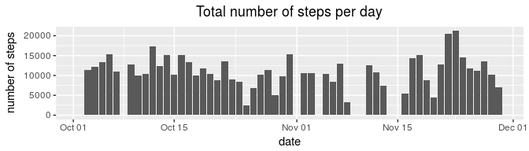
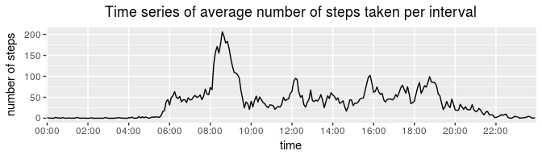
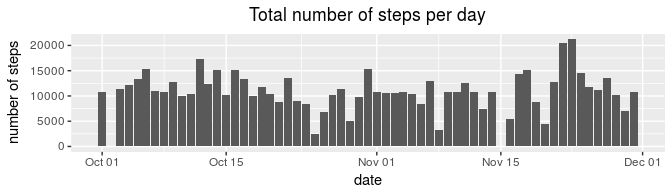
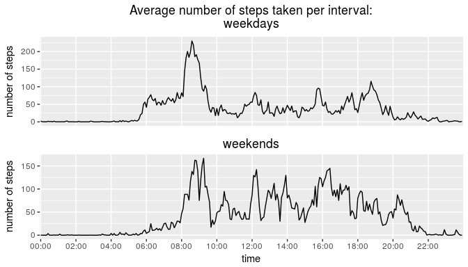

### Loading and preprocessing the data

Separate function `obtain_data` is added to check the presence of RAW data
locally, if data isn't present it will be loaded from the internet.


```r
## obtain the data
obtain_data <- function(filename, archive_filename, url_location) {
        if (!file.exists(filename) && !file.exists(archive_filename)) {
                download.file(url_location, archive_filename, method = "auto")
        }
        if (!file.exists(filename) && file.exists(archive_filename)) {
                unzip(archive_filename)
        }
        if (!file.exists(filename)) {
                stop("activity data is unavailable: cannot process data, stop")
        }
}

act_data_file <- "activity.csv"
act_archive_file <- "activity.zip"
act_url <- "https://d396qusza40orc.cloudfront.net/repdata%2Fdata%2Factivity.zip"
obtain_data(act_data_file, act_archive_file, act_url)

act_df_orig <- read.csv(act_data_file) # original activity dataframe
act_df_nona <- na.omit(act_df_orig) # activity dataframe without NA values
```

In provided dataset time is presented in HHMM format. The function
`convert_to_hm_time` is added in order to avoid gaps on graphs (for example
between 1259 and 1300 as far as time is presented by integer type).


```r
## clean and prepare the data
act_df_orig$date <- as.Date(act_df_orig$date, format = "%Y-%m-%d")

convert_time <- function(time_num) {
        h = as.integer(time_num / 100)
        h = paste(if (h < 10) "0" else "", h, sep = "")
        m = time_num %% 100
        m = paste(if (m < 10) "0" else "", m, sep = "")
        paste(h, ":", m, sep = "")
}
act_df_orig$interval <- sapply(act_df_orig$interval, convert_time)
act_df_orig$interval <- factor(act_df_orig$interval)
act_df_nona <- na.omit(act_df_orig)
```

### What is mean total number of steps taken per day?


```r
## 1. Calculate the total number of steps taken per day
total_steps_per_day_nona <- aggregate(steps ~ date, act_df_nona, sum)
```


```r
## 2. Make a histogram of the total number of steps taken each day
chart <- ggplot(total_steps_per_day_nona, aes(date, steps)) +
        geom_col() +
        xlab("date") +
        ylab("number of steps") +
        ggtitle("Total number of steps per day") +
        theme(plot.title = element_text(hjust = 0.5))
chart
```




```r
## 3. Calculate and report the mean and median of the total number of steps
##    taken per day
mean_value_nona <- mean(total_steps_per_day_nona$steps)
median_value_nona <- median(total_steps_per_day_nona$steps)
```
The *mean* of the total number of steps taken per day using original dataset:
10766.19. The *median* of the total number of steps
taken per day using original dataset: 10765.00.

### What is the average daily activity pattern?


```r
## 1. Make a time series plot (i.e. type = "l") of the 5-minute interval
##    (x-axis) and the average number of steps taken, averaged across
##    all days (y-axis)
mean_steps_per_interval_nona <- aggregate(steps ~ interval, act_df_nona, mean)

chart <- ggplot(mean_steps_per_interval_nona, aes(interval, steps, group = 1)) +
        geom_line() +
        scale_x_discrete(breaks = sapply(seq(0, 2355, 200), convert_time)) +
        xlab("time") +
        ylab("number of steps") +
        ggtitle("Time series of average number of steps taken per interval") +
        theme(plot.title = element_text(hjust = 0.5))
chart
```




```r
## 2. Which 5-minute interval, on average across all the days in the dataset,
##    contains the maximum number of steps?
max_num_of_steps_interval_nona <- mean_steps_per_interval_nona[
        which.max(mean_steps_per_interval_nona$steps), "interval"]
```
The average maximum number of steps taken on 08:35.

### Imputing missing values


```r
## 1. Calculate and report the total number of missing values in the
##    dataset (i.e. the total number of rows with NAs)
total_number_of_missing_values <- sum(is.na(act_df_orig))
```
Total number of missing values in provided dataset is
2304.


```r
## 2. Devise a strategy for filling in all of the missing values in the
##    dataset. The strategy does not need to be sophisticated. For example,
##    you could use the mean/median for that day, or the mean for that
##    5-minute interval, etc.
```
As far as dataset contains 2304 missing values
it is important to fill it with values to complete the task. The 'interval'
strategy was taken. This strategy fills NA value in particular interval with
the mean value for intervals across all days. NOTE: the strategy with mean
value per day was considering but ignored because couple of days do not have
data at all, for example 1 or 8 of October.


```r
## 3. Create a new dataset that is equal to the original dataset but with
##    the missing data filled in.
mean_steps_per_interval_orig <- aggregate(steps ~ interval, act_df_orig, mean)
act_df_mean <- merge(x = act_df_orig,
                     y = mean_steps_per_interval_orig,
                     by = "interval")
act_df_mean$steps <- ifelse(is.na(act_df_mean$steps.x),
                            act_df_mean$steps.y,
                            act_df_mean$steps.x) 
act_df_mean <- act_df_mean[c("steps", "date", "interval")]
```


```r
## 4. Make a histogram of the total number of steps taken each day and
##    Calculate and report the mean and median total number of steps taken per
##    day. Do these values differ from the estimates from the first part of the
##    assignment? What is the impact of imputing missing data on the estimates
##    of the total daily number of steps?
total_steps_per_day_nona_mean <- aggregate(steps ~ date, act_df_mean, sum)

chart <- ggplot(total_steps_per_day_nona_mean, aes(date, steps)) +
        geom_col() +
        xlab("date") +
        ylab("number of steps") +
        ggtitle("Total number of steps per day") +
        theme(plot.title = element_text(hjust = 0.5))
chart
```



```r
mean_value_nona_mean <- mean(total_steps_per_day_nona_mean$steps)
median_value_nona_mean <- median(total_steps_per_day_nona_mean$steps)
```
The *mean* of the total number of steps taken per day according to modified
dataset using 'interval' strategy: 10766.19.
The *median* of the total number of steps taken per day according to modified
dataset using 'interval' strategy: 10766.19.

Notice the small difference between *median* values in comparison with previous
calculations (1.1886792). This is the
result of adding mean values instead of NA values, thus, using this strategy
we also increased the amount of median values equal to the mean. This is the
reason of getting such result as an outcome.

### Are there differences in activity patterns between weekdays and weekends?


```r
## 1. Create a new factor variable in the dataset with two levels "weekday"
##    and "weekend" indicating whether a given date is a weekday or weekend day.
act_df_mean$daytype <- as.factor(
        ifelse(weekdays(act_df_mean$date) %in% c("Saturday", "Sunday"),
               "weekend", "weekday"))
act_df_mean_wd <- act_df_mean[act_df_mean$daytype == "weekday",]
act_df_mean_we <- act_df_mean[act_df_mean$daytype == "weekend",]
```


```r
## 2. Make a panel plot containing a time series plot (i.e. type = "l") of the
##    5-minute interval (x-axis) and the average number of steps taken,
##    averaged across all weekday days or weekend days (y-axis). See the README
##    file in the GitHub repository to see an example of what this plot should
##    look like using simulated data.
mean_steps_per_interval_wd <- aggregate(steps ~ interval, act_df_mean_wd, mean)
mean_steps_per_interval_we <- aggregate(steps ~ interval, act_df_mean_we, mean)

chart0 <- ggplot(mean_steps_per_interval_wd, aes(interval, steps, group = 1)) +
        geom_line() +
        scale_x_discrete(breaks = sapply(seq(0, 2355, 200), convert_time)) +
        ylab("number of steps") +
        ggtitle("Average number of steps taken per interval:\nweekdays") +
        theme(plot.title = element_text(hjust = 0.5),
              axis.title.x = element_blank(),
              axis.text.x = element_blank(),
              axis.ticks.x = element_blank())
chart1 <- ggplot(mean_steps_per_interval_we, aes(interval, steps, group = 1)) +
        geom_line() +
        scale_x_discrete(breaks = sapply(seq(0, 2355, 200), convert_time)) +
        xlab("time") +
        ylab("number of steps") +
        ggtitle("weekends") +
        theme(plot.title = element_text(hjust = 0.5))

grid.arrange(chart0, chart1, nrow = 2)
```


