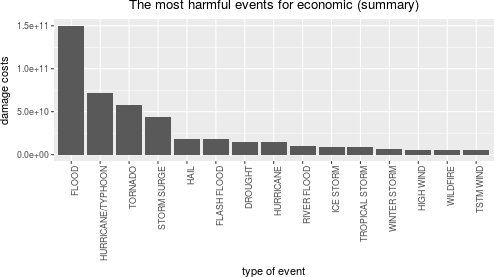
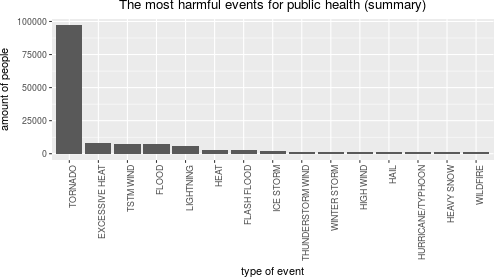
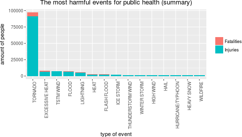
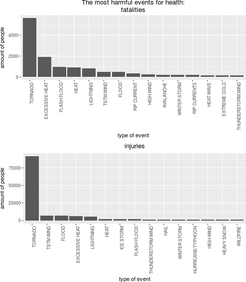
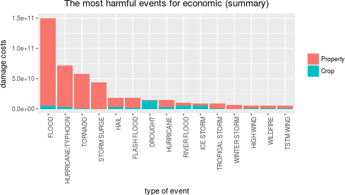
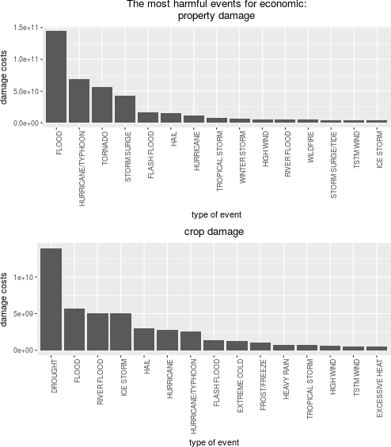

### Abstract
The exploration of statistical data of severe weather in U.S. helps to identify
which regions require more attention to this problem. In order to reveal this
information the U.S. National Oceanic and Atmospheric Administration's (NOAA)
storm database is using in this analysis. This paper analyses the casualties of
specific events across the U.S.: fatalities, injuries, property and crop damage.
According to this paper tornado is the most harmful event for public health.
Flood and typhoon events cause the biggest negative impact to the economic
of region.

### Exploration of Public Health Damage

Next histogram shows 15 most harmful events for
public health:


```
##                EVTYPE HEALTHTOTAL
## 826           TORNADO       96979
## 124    EXCESSIVE HEAT        8428
## 846         TSTM WIND        7461
## 167             FLOOD        7259
## 453         LIGHTNING        6046
## 271              HEAT        3037
## 151       FLASH FLOOD        2755
## 422         ICE STORM        2064
## 753 THUNDERSTORM WIND        1621
## 962      WINTER STORM        1527
## 343         HIGH WIND        1385
## 241              HAIL        1376
## 393 HURRICANE/TYPHOON        1339
## 299        HEAVY SNOW        1148
## 949          WILDFIRE         986
```

The biggest damage is coming from tornado, then excessive heat and tstm wind.

### Exploration of Economic Damage

Next histogram shows 15 most harmful events for
economic of regions:



```
##                EVTYPE     ECOTOTAL
## 167             FLOOD 150319678257
## 393 HURRICANE/TYPHOON  71913712800
## 826           TORNADO  57362333946
## 656       STORM SURGE  43323541000
## 241              HAIL  18761221986
## 151       FLASH FLOOD  18243991078
## 91            DROUGHT  15018672000
## 385         HURRICANE  14610229010
## 577       RIVER FLOOD  10148404500
## 422         ICE STORM   8967041360
## 839    TROPICAL STORM   8382236550
## 962      WINTER STORM   6715441251
## 343         HIGH WIND   5908617595
## 949          WILDFIRE   5060586800
## 846         TSTM WIND   5038935845
```

The biggest economic damage is coming from flood, then hurricane and tornado.

### Algorithm of exploration NOAA storm database for this research

NOAA storm database contains a lot of severe wheather types. There is no
necessity to display every possible event because most of them didn't cause
health or economic consequences. This is the reason why across the research
only 15 most harmful events are being displayed.


```r
max_events_to_display <- 15
```

Separate function `obtain_data` is added to check the presence of RAW data
locally, if data isn't present it will be loaded from the internet.


```r
## obtain the data
obtain_data <- function(filename, archive_filename, url_location) {
        if (!file.exists(filename) && !file.exists(archive_filename)) {
                download.file(url_location, archive_filename, method = "auto")
        }
        if (!file.exists(filename) && file.exists(archive_filename)) {
                bunzip2(archive_filename, filename, remove = FALSE, skip = TRUE)
        }
        if (!file.exists(filename)) {
                stop("storm data is unavailable: cannot process data, stop")
        }
}

## storm data sources
storm_data_file <- "StormData.csv"
storm_archive_file <- "StormData.csv.bz2"
storm_url <- "https://d396qusza40orc.cloudfront.net/repdata%2Fdata%2FStormData.csv.bz2"

obtain_data(storm_data_file, storm_archive_file, storm_url)

## usual reading
# storm_data <- read.csv(storm_data_file)
## fast reading
storm_data <- fread(storm_data_file)

storm_data_orig <- storm_data
```

The most interesting data for analysing is located in the following variables:

* EVTYPE - type of event
* FATALITIES - the amount of fatalities
* INJURIES - the amount of injuries
* PROPDMG - property damage cost
* PROPDMGEXP - property damage value multiplier
* CROPDMG - crop damage cost
* CROPDMGEXP - crop damage value multiplier

As far as there is no clean representation of damage values it is necessary to
transform it to separate dedicated value to perform analysis:

* PROPDMG and PROPDMGEXP to PROPDMGGEN
* CROPDMG and CROPDMGEXP to CROPDMGGEN

In order to perform this adjustment
[convertion algorithm](https://rstudio-pubs-static.s3.amazonaws.com/58957_37b6723ee52b455990e149edde45e5b6.html)
was used. This algorithm suggest juxtaposition between 'EXP' and numeric values.
In order to safely use this algorithm it is important to prove that there is no
change between article author's data and NOAA database which is used on this
paper. To do this the `unique` command was performed under the same columns.
The unique 'EXP' values are the same.


```r
unique(storm_data_orig$PROPDMGEXP)
```

```
##  [1] "K" "M" ""  "B" "m" "+" "0" "5" "6" "?" "4" "2" "3" "h" "7" "H" "-"
## [18] "1" "8"
```

```r
unique(storm_data_orig$CROPDMGEXP)
```

```
## [1] ""  "M" "K" "m" "B" "?" "0" "k" "2"
```

The following clean and preparation section was used to clean data before
using it in this paper.


```r
## clean and prepare the data
## convert property damage values using PROPDMG and PROPDMGEXP values
exp_names <- c("K", "M",  "", "B", "m", "+", "0", "5", "6", "?",
               "4", "2", "3", "h", "7", "H", "-", "1", "8")
exp_values <- c(1e3, 1e6, 1e0, 1e9, 1e6, 1e0, 1e0, 1e5, 1e6, 1e0,
                1e4, 1e2, 1e3, 1e0, 1e7, 1e2, 1e0, 1e1, 1e8)
genuine_prop_dmg <- mapvalues(storm_data$PROPDMGEXP, exp_names, exp_values)
storm_data$PROPDMGGEN <- as.numeric(genuine_prop_dmg) * storm_data$PROPDMG

## convert crop damage values using CROPDMG and CROPDMGEXP values
exp_names <- c( "", "M", "K", "m", "B", "?", "0", "k", "2")
exp_values <- c(1e0, 1e6, 1e3, 1e6, 1e9, 1e0, 1e0, 1e3, 1e2)
genuine_crop_dmg <- mapvalues(storm_data$CROPDMGEXP, exp_names, exp_values)
storm_data$CROPDMGGEN <- as.numeric(genuine_crop_dmg) * storm_data$CROPDMG

storm_data <- storm_data[, c("EVTYPE",
                             "FATALITIES", "INJURIES",
                             "PROPDMGGEN", "CROPDMGGEN")]
```

All fatalities and injuries were summarized in order to provide chart of total
health damage caused by severe wheather events.


```r
## 1. Across the United States, which types of events (as indicated in the
##    EVTYPE variable) are most harmful with respect to population health?
storm_data$HEALTHTOTAL <- storm_data$FATALITIES + storm_data$INJURIES

health_dmg <- aggregate(HEALTHTOTAL ~ EVTYPE, storm_data, sum)
health_dmg <- health_dmg[order(health_dmg$HEALTHTOTAL,
                               decreasing = TRUE),][1:max_events_to_display,]
```


```r
health_chart <- ggplot(health_dmg, aes(reorder(EVTYPE, -HEALTHTOTAL),
                                       HEALTHTOTAL, label = HEALTHTOTAL)) +
        geom_col() +
        xlab("type of event") +
        ylab("amount of people") +
        ggtitle("The most harmful events for public health (summary)") +
        theme(plot.title = element_text(hjust = 0.5),
              axis.text.x = element_text(angle = 90, hjust = 1))
health_chart
```



```r
health_dmg
```

```
##                EVTYPE HEALTHTOTAL
## 826           TORNADO       96979
## 124    EXCESSIVE HEAT        8428
## 846         TSTM WIND        7461
## 167             FLOOD        7259
## 453         LIGHTNING        6046
## 271              HEAT        3037
## 151       FLASH FLOOD        2755
## 422         ICE STORM        2064
## 753 THUNDERSTORM WIND        1621
## 962      WINTER STORM        1527
## 343         HIGH WIND        1385
## 241              HAIL        1376
## 393 HURRICANE/TYPHOON        1339
## 299        HEAVY SNOW        1148
## 949          WILDFIRE         986
```

The next chart helps to determine which part of all damage belongs to either
fatalities or injuries health damage


```r
health_allo_dmg <- aggregate(cbind(FATALITIES, INJURIES, HEALTHTOTAL) ~ EVTYPE,
                             storm_data, sum)
health_allo_dmg <- health_allo_dmg[
        order(health_allo_dmg$HEALTHTOTAL,
              decreasing = TRUE),][1:max_events_to_display,]
health_allo_dmg_data <- health_allo_dmg[, c("FATALITIES", "INJURIES")]
health_allo_dmg_data <- data.frame(rows = health_allo_dmg$EVTYPE,
                                   stack(health_allo_dmg_data))
health_allo_dmg_data
```

```
##                 rows values        ind
## 1            TORNADO   5633 FATALITIES
## 2     EXCESSIVE HEAT   1903 FATALITIES
## 3          TSTM WIND    504 FATALITIES
## 4              FLOOD    470 FATALITIES
## 5          LIGHTNING    816 FATALITIES
## 6               HEAT    937 FATALITIES
## 7        FLASH FLOOD    978 FATALITIES
## 8          ICE STORM     89 FATALITIES
## 9  THUNDERSTORM WIND    133 FATALITIES
## 10      WINTER STORM    206 FATALITIES
## 11         HIGH WIND    248 FATALITIES
## 12              HAIL     15 FATALITIES
## 13 HURRICANE/TYPHOON     64 FATALITIES
## 14        HEAVY SNOW    127 FATALITIES
## 15          WILDFIRE     75 FATALITIES
## 16           TORNADO  91346   INJURIES
## 17    EXCESSIVE HEAT   6525   INJURIES
## 18         TSTM WIND   6957   INJURIES
## 19             FLOOD   6789   INJURIES
## 20         LIGHTNING   5230   INJURIES
## 21              HEAT   2100   INJURIES
## 22       FLASH FLOOD   1777   INJURIES
## 23         ICE STORM   1975   INJURIES
## 24 THUNDERSTORM WIND   1488   INJURIES
## 25      WINTER STORM   1321   INJURIES
## 26         HIGH WIND   1137   INJURIES
## 27              HAIL   1361   INJURIES
## 28 HURRICANE/TYPHOON   1275   INJURIES
## 29        HEAVY SNOW   1021   INJURIES
## 30          WILDFIRE    911   INJURIES
```


```r
health_allo_chart <- ggplot(health_allo_dmg_data,
                            aes(reorder(rows, -values),
                                values,
                                label = rows,
                                group = ind,
                                fill = ind)) +
        geom_col() +
        xlab("type of event") +
        ylab("amount of people") +
        ggtitle("The most harmful events for public health (summary)") +
        theme(plot.title = element_text(hjust = 0.5),
              axis.text.x = element_text(angle = 90, hjust = 1),
              legend.title = element_blank()) +
        scale_fill_discrete(labels = c("Fatalities", "Injuries"))
health_allo_chart
```



The following two charts shows the most harmful events for health - fatalities
and crop separately:


```r
fatalities_dmg <- aggregate(FATALITIES ~ EVTYPE, storm_data, sum)
fatalities_dmg <- fatalities_dmg[
        order(fatalities_dmg$FATALITIES,
              decreasing = TRUE),][1:max_events_to_display,]
fatalities_dmg
```

```
##                EVTYPE FATALITIES
## 826           TORNADO       5633
## 124    EXCESSIVE HEAT       1903
## 151       FLASH FLOOD        978
## 271              HEAT        937
## 453         LIGHTNING        816
## 846         TSTM WIND        504
## 167             FLOOD        470
## 572       RIP CURRENT        368
## 343         HIGH WIND        248
## 19          AVALANCHE        224
## 962      WINTER STORM        206
## 573      RIP CURRENTS        204
## 273         HEAT WAVE        172
## 132      EXTREME COLD        160
## 753 THUNDERSTORM WIND        133
```

```r
injuries_dmg <- aggregate(INJURIES ~ EVTYPE, storm_data, sum)
injuries_dmg <- injuries_dmg[
        order(injuries_dmg$INJURIES,
              decreasing = TRUE),][1:max_events_to_display,]
injuries_dmg
```

```
##                EVTYPE INJURIES
## 826           TORNADO    91346
## 846         TSTM WIND     6957
## 167             FLOOD     6789
## 124    EXCESSIVE HEAT     6525
## 453         LIGHTNING     5230
## 271              HEAT     2100
## 422         ICE STORM     1975
## 151       FLASH FLOOD     1777
## 753 THUNDERSTORM WIND     1488
## 241              HAIL     1361
## 962      WINTER STORM     1321
## 393 HURRICANE/TYPHOON     1275
## 343         HIGH WIND     1137
## 299        HEAVY SNOW     1021
## 949          WILDFIRE      911
```


```r
fatalities_chart <- ggplot(fatalities_dmg,
                           aes(reorder(EVTYPE, -FATALITIES),
                               FATALITIES, label = FATALITIES)) +
        geom_col() +
        xlab("type of event") +
        ylab("amount of people") +
        ggtitle("The most harmful events for health:\nfatalities") +
        theme(plot.title = element_text(hjust = 0.5),
              axis.text.x = element_text(angle = 90, hjust = 1))
injuries_chart <- ggplot(injuries_dmg,
                         aes(reorder(EVTYPE, -INJURIES),
                             INJURIES, label = INJURIES)) +
        geom_col() +
        xlab("type of event") +
        ylab("amount of people") +
        ggtitle("injuries") +
        theme(plot.title = element_text(hjust = 0.5),
              axis.text.x = element_text(angle = 90, hjust = 1))

grid.arrange(fatalities_chart, injuries_chart, nrow = 2)
```



All property and crop costs were summarized in order to provide chart of total
economic damage caused by severe wheather events.


```r
## 2. Across the United States, which types of events have the greatest
##    economic consequences?
storm_data$ECOTOTAL <- storm_data$PROPDMGGEN + storm_data$CROPDMGGEN

eco_dmg <- aggregate(ECOTOTAL ~ EVTYPE, storm_data, sum)
eco_dmg <- eco_dmg[order(eco_dmg$ECOTOTAL,
                         decreasing = TRUE),][1:max_events_to_display,]
```


```r
eco_chart <- ggplot(eco_dmg, aes(reorder(EVTYPE, -ECOTOTAL),
                                 ECOTOTAL, label = ECOTOTAL)) +
        geom_col() +
        xlab("type of event") +
        ylab("damage costs") +
        ggtitle("The most harmful events for economic (summary)") +
        theme(plot.title = element_text(hjust = 0.5),
              axis.text.x = element_text(angle = 90, hjust = 1))
eco_chart
```


```r
eco_dmg
```

```
##                EVTYPE     ECOTOTAL
## 167             FLOOD 150319678257
## 393 HURRICANE/TYPHOON  71913712800
## 826           TORNADO  57362333946
## 656       STORM SURGE  43323541000
## 241              HAIL  18761221986
## 151       FLASH FLOOD  18243991078
## 91            DROUGHT  15018672000
## 385         HURRICANE  14610229010
## 577       RIVER FLOOD  10148404500
## 422         ICE STORM   8967041360
## 839    TROPICAL STORM   8382236550
## 962      WINTER STORM   6715441251
## 343         HIGH WIND   5908617595
## 949          WILDFIRE   5060586800
## 846         TSTM WIND   5038935845
```

The next chart helps to determine which part of all damage belongs to either
crop or property damage


```r
eco_allo_dmg <- aggregate(cbind(PROPDMGGEN, CROPDMGGEN, ECOTOTAL) ~ EVTYPE,
                          storm_data, sum)
eco_allo_dmg <- eco_allo_dmg[
        order(eco_allo_dmg$ECOTOTAL,
              decreasing = TRUE),][1:max_events_to_display,]
eco_allo_dmg_data <- eco_allo_dmg[, c("PROPDMGGEN", "CROPDMGGEN")]
eco_allo_dmg_data <- data.frame(rows = eco_allo_dmg$EVTYPE,
                                stack(eco_allo_dmg_data))
eco_allo_dmg_data
```

```
##                 rows       values        ind
## 1              FLOOD 144657709807 PROPDMGGEN
## 2  HURRICANE/TYPHOON  69305840000 PROPDMGGEN
## 3            TORNADO  56947380676 PROPDMGGEN
## 4        STORM SURGE  43323536000 PROPDMGGEN
## 5               HAIL  15735267513 PROPDMGGEN
## 6        FLASH FLOOD  16822673978 PROPDMGGEN
## 7            DROUGHT   1046106000 PROPDMGGEN
## 8          HURRICANE  11868319010 PROPDMGGEN
## 9        RIVER FLOOD   5118945500 PROPDMGGEN
## 10         ICE STORM   3944927860 PROPDMGGEN
## 11    TROPICAL STORM   7703890550 PROPDMGGEN
## 12      WINTER STORM   6688497251 PROPDMGGEN
## 13         HIGH WIND   5270046295 PROPDMGGEN
## 14          WILDFIRE   4765114000 PROPDMGGEN
## 15         TSTM WIND   4484928495 PROPDMGGEN
## 16             FLOOD   5661968450 CROPDMGGEN
## 17 HURRICANE/TYPHOON   2607872800 CROPDMGGEN
## 18           TORNADO    414953270 CROPDMGGEN
## 19       STORM SURGE         5000 CROPDMGGEN
## 20              HAIL   3025954473 CROPDMGGEN
## 21       FLASH FLOOD   1421317100 CROPDMGGEN
## 22           DROUGHT  13972566000 CROPDMGGEN
## 23         HURRICANE   2741910000 CROPDMGGEN
## 24       RIVER FLOOD   5029459000 CROPDMGGEN
## 25         ICE STORM   5022113500 CROPDMGGEN
## 26    TROPICAL STORM    678346000 CROPDMGGEN
## 27      WINTER STORM     26944000 CROPDMGGEN
## 28         HIGH WIND    638571300 CROPDMGGEN
## 29          WILDFIRE    295472800 CROPDMGGEN
## 30         TSTM WIND    554007350 CROPDMGGEN
```


```r
eco_allo_chart <- ggplot(eco_allo_dmg_data,
                         aes(reorder(rows, -values), values,
                             label = rows, group = ind, fill = ind)) +
        geom_col() +
        xlab("type of event") +
        ylab("damage costs") +
        ggtitle("The most harmful events for economic (summary)") +
        theme(plot.title = element_text(hjust = 0.5),
              axis.text.x = element_text(angle = 90, hjust = 1),
              legend.title = element_blank()) +
        scale_fill_discrete(labels = c("Property", "Crop"))
eco_allo_chart
```



The following two charts shows the most harmful events for economic for
property and crop separately:


```r
prop_dmg <- aggregate(PROPDMGGEN ~ EVTYPE, storm_data, sum)
prop_dmg <- prop_dmg[order(prop_dmg$PROPDMGGEN,
                           decreasing = TRUE),][1:max_events_to_display,]
prop_dmg
```

```
##                EVTYPE   PROPDMGGEN
## 167             FLOOD 144657709807
## 393 HURRICANE/TYPHOON  69305840000
## 826           TORNADO  56947380676
## 656       STORM SURGE  43323536000
## 151       FLASH FLOOD  16822673978
## 241              HAIL  15735267513
## 385         HURRICANE  11868319010
## 839    TROPICAL STORM   7703890550
## 962      WINTER STORM   6688497251
## 343         HIGH WIND   5270046295
## 577       RIVER FLOOD   5118945500
## 949          WILDFIRE   4765114000
## 657  STORM SURGE/TIDE   4641188000
## 846         TSTM WIND   4484928495
## 422         ICE STORM   3944927860
```

```r
crop_dmg <- aggregate(CROPDMGGEN ~ EVTYPE, storm_data, sum)
crop_dmg <- crop_dmg[order(crop_dmg$CROPDMGGEN,
                           decreasing = TRUE),][1:max_events_to_display,]
crop_dmg
```

```
##                EVTYPE  CROPDMGGEN
## 91            DROUGHT 13972566000
## 167             FLOOD  5661968450
## 577       RIVER FLOOD  5029459000
## 422         ICE STORM  5022113500
## 241              HAIL  3025954473
## 385         HURRICANE  2741910000
## 393 HURRICANE/TYPHOON  2607872800
## 151       FLASH FLOOD  1421317100
## 132      EXTREME COLD  1292973000
## 198      FROST/FREEZE  1094086000
## 281        HEAVY RAIN   733399800
## 839    TROPICAL STORM   678346000
## 343         HIGH WIND   638571300
## 846         TSTM WIND   554007350
## 124    EXCESSIVE HEAT   492402000
```


```r
prop_chart <- ggplot(prop_dmg, aes(reorder(EVTYPE, -PROPDMGGEN),
                                   PROPDMGGEN, label = PROPDMGGEN)) +
        geom_col() +
        xlab("type of event") +
        ylab("damage costs") +
        ggtitle("The most harmful events for economic:\nproperty damage") +
        theme(plot.title = element_text(hjust = 0.5),
              axis.text.x = element_text(angle = 90, hjust = 1))
crop_chart <- ggplot(crop_dmg, aes(reorder(EVTYPE, -CROPDMGGEN),
                                   CROPDMGGEN, label = CROPDMGGEN)) +
        geom_col() +
        xlab("type of event") +
        ylab("damage costs") +
        ggtitle("crop damage") +
        theme(plot.title = element_text(hjust = 0.5),
              axis.text.x = element_text(angle = 90, hjust = 1))

grid.arrange(prop_chart, crop_chart, nrow = 2)
```




### Conclusion
Based on NOAA storm database this paper proves that the most harmful event
according to public health is tornado. The most harmful event according to
economic consequences is flood.
