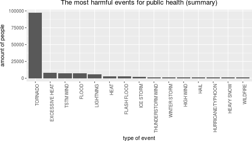
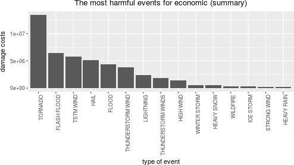

### Synopsis
The exploration of statistical data of severe weather in U.S. helps to identify
which regions require more attention to this problem. In order to reveal this
information the U.S. National Oceanic and Atmospheric Administration's (NOAA)
storm database is using in this analysis. This paper analyses the casualties of
specific events across the U.S.: fatalities, injuries, property and crop damage.
According to this paper tornado is the most harmful event for public health.
Flood and typhoon events cause the biggest negative impact to the economic
of region.

### Data Processing

NOAA storm database contains a lot of severe wheather types. There is no
necessity to display every possible event because most of them didn't cause
health or economic consequences. This is the reason why across the research
only 15 most harmful events are being displayed.


```r
max_events_to_display <- 15
```

Separate function `obtain_data` is added to check the presence of RAW data
locally, if data isn't present it will be loaded from the internet.


```r
## obtain the data
obtain_data <- function(filename, archive_filename, url_location) {
        if (!file.exists(filename) && !file.exists(archive_filename)) {
                download.file(url_location, archive_filename, method = "auto")
        }
        if (!file.exists(filename) && file.exists(archive_filename)) {
                bunzip2(archive_filename, filename, remove = FALSE, skip = TRUE)
        }
        if (!file.exists(filename)) {
                stop("storm data is unavailable: cannot process data, stop")
        }
}

## storm data sources
storm_data_file <- "StormData.csv"
storm_archive_file <- "StormData.csv.bz2"
storm_url <- "https://d396qusza40orc.cloudfront.net/repdata%2Fdata%2FStormData.csv.bz2"

obtain_data(storm_data_file, storm_archive_file, storm_url)
storm_data <- read.csv(storm_data_file)
storm_data_orig <- storm_data
```

The most interesting data for analysing is located in the following variables:

* EVTYPE - type of event
* FATALITIES - the amount of fatalities
* INJURIES - the amount of injuries
* PROPDMG - property damage cost
* PROPDMGEXP - property damage value multiplier
* CROPDMG - crop damage cost
* CROPDMGEXP - crop damage value multiplier

As far as there is no clean representation of damage values it is necessary to
transform it to separate dedicated value to perform analysis:

* PROPDMG and PROPDMGEXP to PROPDMGGEN
* CROPDMG and CROPDMGEXP to CROPDMGGEN

In order to perform this adjustment
[convertion algorithm](https://rstudio-pubs-static.s3.amazonaws.com/58957_37b6723ee52b455990e149edde45e5b6.html)
was used. This algorithm suggest juxtaposition between 'EXP' and numeric values.
In order to safely use this algorithm it is important to prove that there is no
change between article author's data and NOAA database which is used on this
paper. To do this the `unique` command was performed under the same columns.
The unique 'EXP' values are the same.


```r
unique(storm_data_orig$PROPDMGEXP)
```

```
##  [1] K M   B m + 0 5 6 ? 4 2 3 h 7 H - 1 8
## Levels:  + - 0 1 2 3 4 5 6 7 8 ? B H K M h m
```

```r
unique(storm_data_orig$CROPDMGEXP)
```

```
## [1]   M K m B ? 0 k 2
## Levels:  0 2 ? B K M k m
```

The following clean and preparation section was used to clean data before
using it in this paper.


```r
## clean and prepare the data
## convert property damage values using PROPDMG and PROPDMGEXP values
exp_names <- c("K", "M",  "", "B", "m", "+", "0", "5", "6", "?",
               "4", "2", "3", "h", "7", "H", "-", "1", "8")
exp_values <- c(1e3, 1e6, 1e0, 1e9, 1e6, 1e0, 1e0, 1e5, 1e6, 1e0,
                1e4, 1e2, 1e3, 1e0, 1e7, 1e2, 1e0, 1e1, 1e8)
genuine_prop_dmg <- mapvalues(storm_data$PROPDMGEXP, exp_names, exp_values)
storm_data$PROPDMGGEN <- as.numeric(genuine_prop_dmg) * storm_data$PROPDMG

## convert crop damage values using CROPDMG and CROPDMGEXP values
exp_names <- c( "", "M", "K", "m", "B", "?", "0", "k", "2")
exp_values <- c(1e0, 1e6, 1e3, 1e6, 1e9, 1e0, 1e0, 1e3, 1e2)
genuine_crop_dmg <- mapvalues(storm_data$CROPDMGEXP, exp_names, exp_values)
storm_data$CROPDMGGEN <- as.numeric(genuine_crop_dmg) * storm_data$CROPDMG

storm_data <- storm_data[, c("EVTYPE",
                             "FATALITIES", "INJURIES",
                             "PROPDMGGEN", "CROPDMGGEN")]
```

All fatalities and injuries were summarized in order to provide chart of total
health damage caused by severe wheather events.


```r
## 1. Across the United States, which types of events (as indicated in the
##    EVTYPE variable) are most harmful with respect to population health?
storm_data$HEALTHTOTAL <- storm_data$FATALITIES + storm_data$INJURIES

health_dmg <- aggregate(HEALTHTOTAL ~ EVTYPE, storm_data, sum)
health_dmg <- health_dmg[order(health_dmg$HEALTHTOTAL,
                               decreasing = TRUE),][1:max_events_to_display,]
```


```r
health_chart <- ggplot(health_dmg, aes(reorder(EVTYPE, -HEALTHTOTAL),
                                       HEALTHTOTAL, label = HEALTHTOTAL)) +
        geom_col() +
        xlab("type of event") +
        ylab("amount of people") +
        ggtitle("The most harmful events for public health (summary)") +
        theme(plot.title = element_text(hjust = 0.5),
              axis.text.x = element_text(angle = 90, hjust = 1))
health_chart
```



```r
health_dmg
```

```
##                EVTYPE HEALTHTOTAL
## 826           TORNADO       96979
## 124    EXCESSIVE HEAT        8428
## 846         TSTM WIND        7461
## 167             FLOOD        7259
## 453         LIGHTNING        6046
## 271              HEAT        3037
## 151       FLASH FLOOD        2755
## 422         ICE STORM        2064
## 753 THUNDERSTORM WIND        1621
## 962      WINTER STORM        1527
## 343         HIGH WIND        1385
## 241              HAIL        1376
## 393 HURRICANE/TYPHOON        1339
## 299        HEAVY SNOW        1148
## 949          WILDFIRE         986
```

All property and crop costs were summarized in order to provide chart of total
economic damage caused by severe wheather events.


```r
## 2. Across the United States, which types of events have the greatest
##    economic consequences?
storm_data$ECOTOTAL <- storm_data$PROPDMGGEN + storm_data$CROPDMGGEN

eco_dmg <- aggregate(ECOTOTAL ~ EVTYPE, storm_data, sum)
eco_dmg <- eco_dmg[order(eco_dmg$ECOTOTAL,
                         decreasing = TRUE),][1:max_events_to_display,]
```


```r
eco_chart <- ggplot(eco_dmg, aes(reorder(EVTYPE, -ECOTOTAL),
                                 ECOTOTAL, label = ECOTOTAL)) +
        geom_col() +
        xlab("type of event") +
        ylab("damage costs") +
        ggtitle("The most harmful events for economic (summary)") +
        theme(plot.title = element_text(hjust = 0.5),
              axis.text.x = element_text(angle = 90, hjust = 1))
eco_chart
```



```r
eco_dmg
```

```
##                 EVTYPE   ECOTOTAL
## 826            TORNADO 13394009.9
## 151        FLASH FLOOD  6438660.0
## 846          TSTM WIND  5790409.6
## 241               HAIL  5114497.7
## 167              FLOOD  4341956.4
## 753  THUNDERSTORM WIND  3782310.0
## 453          LIGHTNING  2428301.4
## 779 THUNDERSTORM WINDS  1845996.0
## 343          HIGH WIND  1379530.8
## 962       WINTER STORM   543522.3
## 299         HEAVY SNOW   500240.3
## 949           WILDFIRE   366524.7
## 422          ICE STORM   282272.5
## 661        STRONG WIND   258843.3
## 281         HEAVY RAIN   250514.9
```


### Results
Based on NOAA storm database this paper proves that the most harmful event
according to public health is tornado. The most harmful event according to
economic consequences is flood.
